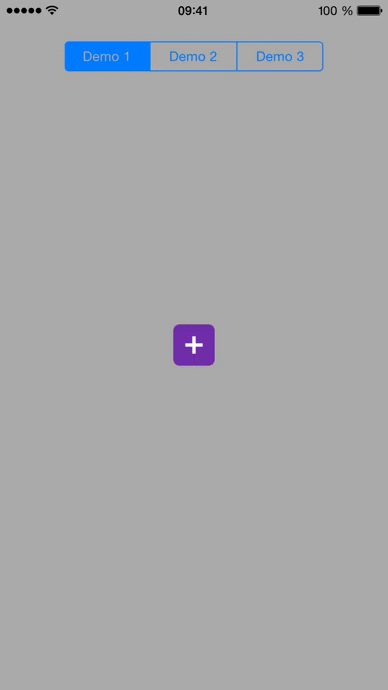

UPStackMenu
===============

`UPStackMenu` is a menu with a stack layout, that can be expanded and collapsed with some fancy animations.



## Requirements

`UPStackMenu` uses ARC and requires iOS 7.0+.

Works for iPhone.

## Installation

### CocoaPods

UPStackMenu is available through [CocoaPods](http://cocoapods.org). To install
it, simply add the following line to your Podfile:

```
pod "UPStackMenu"
```

### Manual

Simply copy the folder `UPStackMenu` to your project and import it in XCode.

## Usage

Start by importing the header file:

```objc
#import "UPStackMenu.h"
```

Now, you can create a `UPStackMenu` object by giving it a content view.

```objc
UPStackMenu *stack = [[UPStackMenu alloc] initWithContentView:aView];
```

Then, you can create some items that will be part of the stack.

```objc
UPStackMenuItem *item = [[UPStackMenuItem alloc] initWithImage:anImage highlightedImage:anImage title:aTitle];
```

Finally, add the items to the stack menu.

```objc
[stack addItems:@[item]];
```

### Delegate

The delegate is optional and will be notified when some events occur:

* `- (void)stackMenuWillOpen:(UPStackMenu*)menu`
* `- (void)stackMenuDidOpen:(UPStackMenu*)menu`
* `- (void)stackMenuWillClose:(UPStackMenu*)menu`
* `- (void)stackMenuDidClose:(UPStackMenu*)menu`
* `- (void)stackMenu:(UPStackMenu*)menu didTouchItem:(UPStackMenuItem*)item atIndex:(NSUInteger)index`

### Methods

| Method                               | Description                                                      |
|--------------------------------------|------------------------------------------------------------------|
| addItem:(UPStackMenuItem*)item       | Add a single item to the stack                                   |
| addItems:(NSArray*)items             | Add a bunch of items to the stack                                |
| removeItem:(UPStackMenuItem*)item    | Remove a specific item from the stack                            |
| removeItemAtIndex:(NSUInteger)index  | Remove a single item from the stack, corresponding to the index  |
| removeAllItems                       | Remove all the stack items                                       |
| items                                | Returns an array containing all the stack items                  |
| openStack                            | Programmatically ask the stack to open and show its items        |
| closeStack                           | Programmatically ask the stack to close and hide its items       |

### Customization

#### UPStackMenu

The stack menu can be customized through several properties.

The `stackPosition` property will determine the location of the stack items according to the stack menu view:

* `UPStackMenuStackPosition_up` - the items will be located above the stack menu view (default)
* `UPStackMenuStackPosition_down` - the items will be located below the stack menu view

You can choose between three items animations when the stack will open and close, as seen in the demo gif:

* `UPStackMenuAnimationType_linear` - as in the demo 2 (default)
* `UPStackMenuAnimationType_progressive` - as in the demo 1
* `UPStackMenuAnimationType_progressiveInverse` - as in the demo 3

The other customizable stack properties are the following:

* `itemsSpacing` - Vertical spacing between each stack menu item, in pixels (default is 6)
* `bouncingAnimation` - Whether the items should bounce at the end of the opening animation, or a the beginning of the closing animaton (default is YES)
* `openAnimationDuration` - Opening animation total duration, in seconds (default is 0.4)
* `closeAnimationDuration` - Closing animation total duration, in seconds (default is 0.4)
* `openAnimationDurationOffset` - Delay between each item animation start during opening, in seconds (default is 0)
* `closeAnimationDurationOffset` - Delay between each item animation start during closing, in seconds (default is 0)

#### UPStackMenuItem

You can choose between two locations for the title of each item, through the `labelPosition` property:

* `UPStackMenuItemLabelPosition_left` - the title will be on the left of the icon (default)
* `UPStackMenuItemLabelPosition_right` - the title will be on the right of the icon

If you want to choose the font of the items' title, it must be made through a specific constructor:

```objc
- (id)initWithImage:(UIImage*)image highlightedImage:(UIImage*)highlightedImage title:(NSString*)title font:(UIFont*)font
```

The title color can also be customized, through the following method:

`- (void)setTitleColor:(UIColor*)color`

## License

    The MIT License (MIT)

    Copyright (c) 2015 Paul Ulric

    Permission is hereby granted, free of charge, to any person obtaining a copy
    of this software and associated documentation files (the "Software"), to deal
    in the Software without restriction, including without limitation the rights
    to use, copy, modify, merge, publish, distribute, sublicense, and/or sell
    copies of the Software, and to permit persons to whom the Software is
    furnished to do so, subject to the following conditions:

    The above copyright notice and this permission notice shall be included in all
    copies or substantial portions of the Software.

    THE SOFTWARE IS PROVIDED "AS IS", WITHOUT WARRANTY OF ANY KIND, EXPRESS OR
    IMPLIED, INCLUDING BUT NOT LIMITED TO THE WARRANTIES OF MERCHANTABILITY,
    FITNESS FOR A PARTICULAR PURPOSE AND NONINFRINGEMENT. IN NO EVENT SHALL THE
    AUTHORS OR COPYRIGHT HOLDERS BE LIABLE FOR ANY CLAIM, DAMAGES OR OTHER
    LIABILITY, WHETHER IN AN ACTION OF CONTRACT, TORT OR OTHERWISE, ARISING FROM,
    OUT OF OR IN CONNECTION WITH THE SOFTWARE OR THE USE OR OTHER DEALINGS IN THE
    SOFTWARE.
